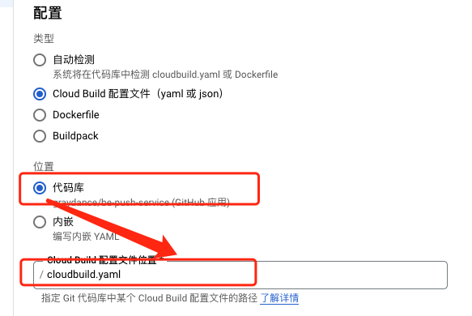

# github.com/quincy0/go-kit

从 go-zero 仓库 fork 而来，在继承 go-zero 众多特性的同时，会在此基础上做一些适配我们自己业务的二次开发。

由于此仓库是一个私有仓库(替换为自己的私有仓库地址)，使用之前需要进行以下配置：

```
go env -w GO111MODULE=on
go env -w GOPRIVATE=github.com/quincy0
git config --global --add url."git@github.com:quincy0/".insteadOf "https://github.com/quincy0/"
```

## 1. Installation

在项目目录下通过如下命令安装：

```shell
GO111MODULE=on GOPROXY=https://goproxy.cn/,direct
go get -u github.com/quincy0/go-kit
```

## 2. Quick Start

0. 完整示例请查看

   [快速构建高并发微服务](https://github.com/zeromicro/zero-doc/blob/main/doc/shorturl.md)

   [快速构建高并发微服务 - 多 RPC 版](https://github.com/zeromicro/zero-doc/blob/main/docs/zero/bookstore.md)

1. 安装 goctl 工具

   `goctl` 读作 `go control`，不要读成 `go C-T-L`。`goctl` 的意思是不要被代码控制，而是要去控制它。其中的 `go` 不是指 `golang`。在设计 `goctl` 之初，我就希望通过 `工具` 来解放我们的双手 👈

   ```shell
   GOPROXY=https://goproxy.cn/,direct
   go install github.com/quincy0/go-kit/tools/goctl@latest

   要特别注意的是，goctl必须从hubbuy/github.com/quincy0/go-kit仓库安装，而不是从go-zero仓库安装。这是因为github.com/quincy0/go-kit里的goctl做了改造
   其可以适配我们自已的开发与生产环境。 关于api文件的声明参考：[goctl使用说明](./tools/goctl/readme.md)

   ```

2. 快速生成 api 服务
   定义.api 文件 greet.api

   ```
    type (
      Request {
         Name string `path:"name,options=you|me"` // parameters are auto validated
      }

      Response {
         Message string `json:"message"`
      }
    )

    service greet-api {
    @handler GreetHandler
      get /greet/from/:name(Request) returns (Response)
    }
   ```

   ```shell
   goctl api go -api greet.api -dir .
   cd greet
   go mod init
   go mod tidy
   go run greet.go -f etc/greet-api.yaml
   ```

   默认侦听在 `8888` 端口（可以在配置文件里修改），可以通过 `curl` 请求：

   ```shell
   curl -i http://localhost:8888/from/you
   ```

   返回如下：

   ```http
   HTTP/1.1 200 OK
   Content-Type: application/json
   Date: Thu, 22 Oct 2020 14:03:18 GMT
   Content-Length: 14

   {"message":""}
   ```

   编写业务代码：

   - api 文件定义了服务对外 HTTP 接口，可参考 [api 规范](https://github.com/zeromicro/zero-doc/blob/main/docs/zero/goctl-api.md)
   - 可以在 `servicecontext.go` 里面传递依赖给 logic，比如 mysql, redis 等
   - 在 api 定义的 `get/post/put/delete` 等请求对应的 logic 里增加业务处理逻辑

3. 可以根据 api 文件生成前端需要的 Java, TypeScript, Dart, JavaScript 代码

   ```shell
   goctl api java -api greet.api -dir greet
   goctl api dart -api greet.api -dir greet
   ...
   ```

4. 生成通用的国际化异常语言包提示文件到项目指定为止
   ```shell
   goctl lang multiInit  -owner hubbuy -repo text_l10n -path /be/account/lang -movePath ./langTest
   ```

## 3. 文档

- API 文档

  [https://go-zero.dev/cn/](https://go-zero.dev/cn/)

- awesome 系列（更多文章见『微服务实践』公众号）

  - [快速构建高并发微服务](https://github.com/zeromicro/zero-doc/blob/main/doc/shorturl.md)
  - [快速构建高并发微服务 - 多 RPC 版](https://github.com/zeromicro/zero-doc/blob/main/docs/zero/bookstore.md)
  - [goctl 使用帮助](https://github.com/zeromicro/zero-doc/blob/main/doc/goctl.md)
  - [Examples](https://github.com/zeromicro/zero-examples)

- 精选 `goctl` 插件

  | 插件                                                              | 用途                                                        |
  | ----------------------------------------------------------------- | :---------------------------------------------------------- |
  | [goctl-swagger](https://github.com/zeromicro/goctl-swagger)       | 一键生成 `api` 的 `swagger` 文档                            |
  | [goctl-android](https://github.com/zeromicro/goctl-android)       | 生成 `java (android)` 端 `http client` 请求代码             |
  | [goctl-go-compact](https://github.com/zeromicro/goctl-go-compact) | 合并 `api` 里同一个 `group` 里的 `handler` 到一个 `go` 文件 |

### 3.1. yapi 同步步骤

1. 安装 goctl-swagger 插件

```
GOPROXY=https://goproxy.cn/,direct
go install github.com/hubbuy/goctl-swagger@latest
```

2. 添加 goctl-swagger 到环境变量

```
export PATH=$PATH:$GOPATH/bin/
```

3. 安装 yapi-cli 工具

```
npm install -g yapi-cli
```

4. 使用 goctl-swagger 生成 swagger 文档（可选步骤）

```
goctl api plugin -plugin goctl-swagger="swagger -filename user.json" -api user.api -dir .
```

5. 配置 yapi 服务的 token

   在$HOME/.docrc 目录下创建 app.json 文件，加入如下配置

   ```
   {
   	"server": "http://yapi.newb.bio/",
   	"apps" : {
   		"demo-api": {
                     "type": "swagger",
                     "token": "17fba0027f300248b804",
                     "appDir": "/apps/demo-api/",
                     "merge": "normal"
                   }
   	}
   }
   ```

   其中各个配置项说明如下：

   server : 表示 yapi 服务器的地址

   apps : 表示一组 app，每一个对应 yapi 里的项目

   ​ demo-api : 表示项目名，这个在同步工具中要用到的，注意：这个名字必须可以找到{appDIr}/demo-api.api 文件

   ​ type: 文档类型，目前 yapi 只支持 swagger

   ​ token: 每个项目中 openapi 的 token， 从项目 api > 配置中复杂，每个项目 token 不一样

   ​ appDir: 这个是工程的根目录，按照规范，.api 文件一定是在根目录下

   ​ merge: 合并方式，normal-如果已经存在不导入 good-已存在的接口，将合并返回数据的 response， mergin-完全覆盖

6. 一件更新 api 文档到 yapi

   ```
   goctl doc -push yapi -app demo-api
   ```

新版本弃用了-push 参数，支持指定.api 文件，例如：

```
 goctl doc -app oms -i ./push.api
```

## 4. 支持 Cloud Run

    1. 触发器需要设置自定义环境变量
        _DEPLOY_REGION : 发布地区
        _SERVICE_NAME : 服务名

    2. cloudbuild配置改成自定义



    3. Cloud Run部署支持私仓
    由于Google云授权代码仓不是以ssh-key的方式。所以，对于代码中引用私有库的情况，会出现找不到仓库的情况。这个问题的解决方案如下：
    a. 创建一个公共的ssh-key私钥
    b. 在cloudbuild.yaml文件中引用

## 5. 开发规范

这个开发规范目前主要针对 Golang 的项目，分为以下几个部分：

1. [工程规范](./doc/工程规范.md)
2. [编码规范](./doc/编码规范.md)
3. [测试规范](./doc/测试规范.md)
4. [发布规范](./doc/发布规范.md)
